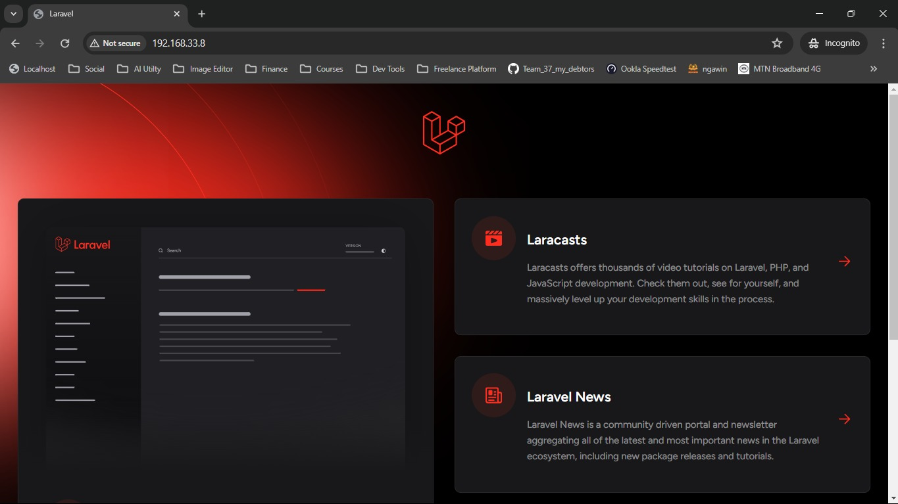

# ALT_SCH FINAL ASSESSMENT 
I created two Virtual Machine (VM): one is the main and the other one is the slave. 

I successfully setup a the second server (the slave VM) and added the IP Address of the host file to the main VM 

The bash script was created and executed to trigger the Cronjob

I performed a ping operation using the host file

I executed the bash script to provision the server using ansible playbook

I was able to access the slave via the web browser and website was live.

